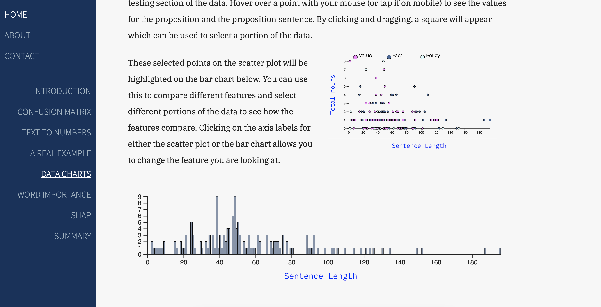

# Honours Project

This repository contains the code and documentation for my Honours project. Completed as part of my BSc in Applied Computing at the University of Dundee. 

The project is split into two parts: Proposition Classification and a Website. 

--- 

## Proposition Classification 
Using data from Presidential debates for the United States Elections in 2016 I created a Machine Learning (ML) classification model. The model aims to classify propositions from the debate as either Fact, Policy, or Value statement. Fact being a statement that can be true or false ('it is raining'), Policy being a proposal for future action ('we should invest in green energy sources'), Value being a subjective assessment ('War and Peace is the best book of all time') (see https://periodic-table-of-arguments.org/ for further details on the class types). 

Various features were used including specificity (using https://github.com/jjessyli/speciteller), sentiment, and part-of-speech. Using a support vector machine model, an F1 of 0.65 was achieved. Different techniques such as hyper-parameter optimisation were used in the project. Code documentation and a technical document were also prepared. 

## Website 
Link: https://zeno.computing.dundee.ac.uk/2019-projects/matthewfoulis/index.html

For the second part of the project an interactive website was developed, demonstrating the results of the ML project alongside various explainable artificial intelligence (XAI) techniques that can be used to try and understand what is behind a ML decision. The website features interactive plots developed using D3.js (https://d3js.org/) which allow users to gain a more involved understanding of various ML and XAI techniques. Documentation and a user manual were also prepared to go with the website. 

